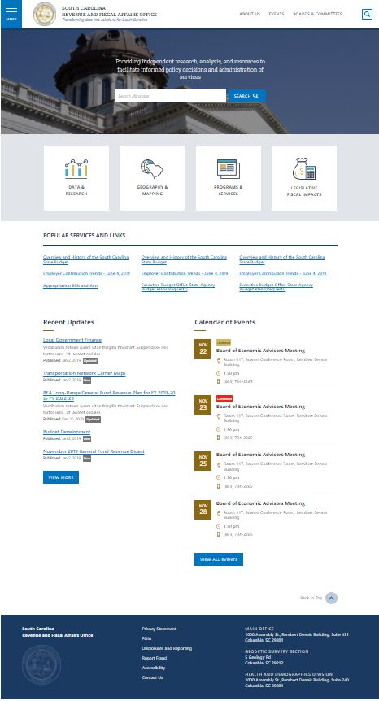
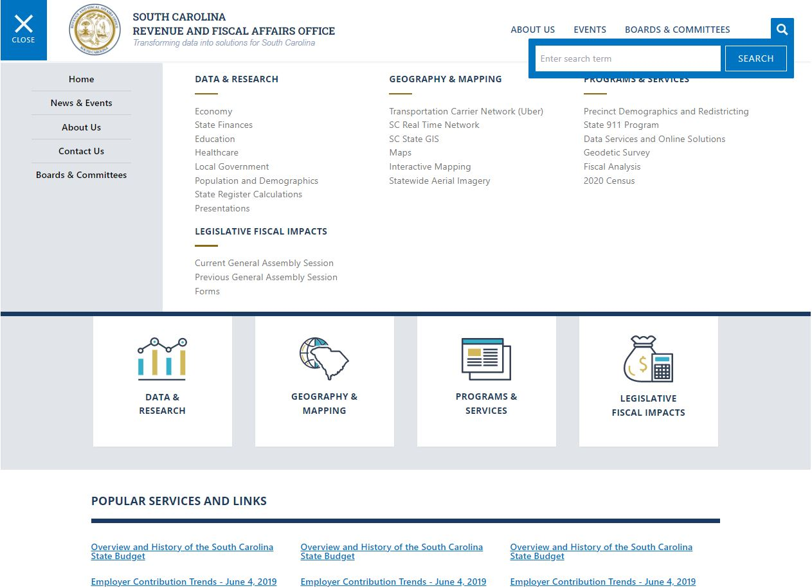
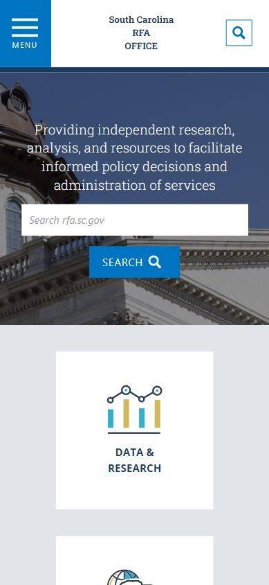

# PWW-exercise

A landing page built to demonstrate my ability to convert a design artifact into a functional web page.

## Table of Contents

- [Introduction](#Introduction)
- [Links](#Links)
- [Screenshots](#Screenshots)
- [Highlights](#Highlights)
- [Functions](#Functions)
- [Prerequisites](#Prerequisites)
- [Scripts](#Scripts)
- [Challenges](#Challenges)
- [Alternatives](#Alternatives)
- [Time-Breakdown](#Time-Breakdown)
- [Acknowledgements](#Acknowledgements)

## Introduction

This web page is a fully styled and responsive landing page for the South Carolina Revenue and Fiscal Affairs Office. It was built to demonstrate my ability to turn a design artifact into a responsive and accessible html document.

## Links

- Deployed: [https://pww-exercise.web.app/](https://pww-exercise.web.app/)
- GitHub: [https://github.com/LanceStasinski/PWW-exercise](https://github.com/LanceStasinski/PWW-exercise)

## Screenshots

### Full Page

### Drop Down Menus

### Mobile View

## Highlights

- HTML document created using React and TypeScript on a scaffhold generated by create-react-app
- Styled with Tailwind CSS
- Mobile-first CSS paradigm implemented with media queries, Flexbox, and Grid
- Renders drop down animations with react-transition-group
- Uses fonts (Open Sans, Roboto Condensed, and Roboto Slab) from the Google Fonts API
- Uses icon SVGs from iconmonstr
- Uses a file structure that separates the main sections of the page
- Unit testing with Jest and React Testing Library
- Passes Accessibility test on Google Lighthouse with 98% - remaining 2% is due to colors that don't have enough contrast (colors were chosen by the designer)

## Features

- Search bar and expanded menu in the navigation bar
- Search bar in hero section of the page
- Four cards that act as links to different important parts of the website
- List of popular links
- List of recent updates and links to the articles
- List of calendar of events with location and contact info
- Button that smoothly scrolls the top of the page into view
- Footer with links and addresses

## Prerequisites

This project was built on a Windows OS with the following tools installed:

- git version 2.31.1.windows.1
- yarn v1.22.10
- NodeJS v16.13.1

## Scripts

First, `cd` into the `pww-exercise` directory.

- `yarn install` will install this project's dependencies
- `yarn build` will create a production build of this project
- `serve -s build` will serve the production build on port 5000
- `yarn start` will start a development server for this project
- `yarn test` will run tests with Jest

NOTE: `npm` can be used instead of `yarn`, and the `serve cli` may need to be installed before using the `serve` command.

## Challenges

This was my first time using Tailwind CSS and it took a little while to get used to; however, I think this will be my go-to CSS framework for now on. It cuts down on the number of files I'm working with, and it's nice to have css and JSX code all in the same place.

Building the web page from the style guide was challenging when it came to implementing responsive design. Some styles were not maintainable at smaller screen sizes. For example, the South Carolina RFA logo does not fit well in the header on mobile screen sizes, and the same goes for the lengthy title and slogan. I decided to address this issue by removing the logo and shortening the heading text for mobile screen widths. I also chose to only display the additional links (which are also available in the menu drop down) for larger screen sizes. I thought the navigation search bar was important so I kept it for all screen sizes. The rest of the page was relatively straightforward to design responsive layouts for, though I did need to take some creative liberties with the calendar section.

Some other minor challenges were:

- Aligning the main navigation search bar properly
- Matching colors with design artifact
- Deciding what size (height) to display the hero background image at

## Alternatives

There are many libraries to construct a web page with, but I chose to use React due to my confortability with the library. I could have also used a different CSS setup (plain CSS, CSS modules, or styled-components), but I chose to use Tailwind CSS because I wanted to learn the framework and I liked how it reduced the file size and number of files. Finally, I could have created the icons using CSS, but it was more convenient to download SVGs, but this does slightly increase the size of the assets folder loaded by the browser.

## Time-Breakdown

- Building the main page minus the drop down features - 19 hours
- Adding the drop down features (menu and search bar) - 4 hours
- Adding unit tests - 4.5 hours
- Writing documentation - 1.5 hours
- Deployment - 0.25 hours
- Total - 29.25 hours

I'm aware that I was allowed to submit this project in a partially completed state, but I had the time and I was excited to build a web page from a professional design pattern and to use this opportunity to learn Tailwind CSS. If I was more limited time, I would have used a CSS method that I was already familiar with, and I would have practiced an Agile mindset by implementing the most valuable features. Typically, these features are decided in consultation with the customer, but my personal ranking of features, from most valuable to least, are:

1. Header/navigation bar - this component will likely be used in other web pages and has links to other important pages
2. The drop down menu - this component has links to many important resources that are not accessible from other links on the page
3. The footer - this component is likely used in other pages and has important links and address information
4. The search bar in the header - this is a reusable feature that can be used to navigate the site
5. The list of the four major departments/programs in the organization - these may useful for a user to narrow down what they are looking for
6. The Popular Services and Links section - these links could be valuable for quickly finding useful information
7. The Calendar of Events section - some users may be interested in upcoming events, and may miss those events if they can't find event detials here
8. The main hero section with the search bar - this adds a level of professionalism to the site and may make the user trust that they will have a modern web experience at the site; however, the user would already have access to the search feature from the search bar in the header
9. Recent updates - These updates are probably not the most important information for the average user
10. The Scroll to Top button - this is a nice feature, but it is less valuable that providing access to necessary information
11. Animations - animations make for a better user experience, but I don't think they are more important than providing access to information

## Acknowledgements

I would like to thank the following:

- Kevin Ferguson from Portalnd Web Works for giving me the opportunity to complete this exercise and for providing the necessary assets
- [tailwindcss](https://tailwindcss.com/) for providing great documentation that allowed me learn the Tailwind framework relatively easily
- [iconmonstr](https://iconmonstr.com/) for providing free-to-use icons
- [GoogleFonts](https://fonts.google.com/) for providing access to the necessary fonts to complete this exercise
